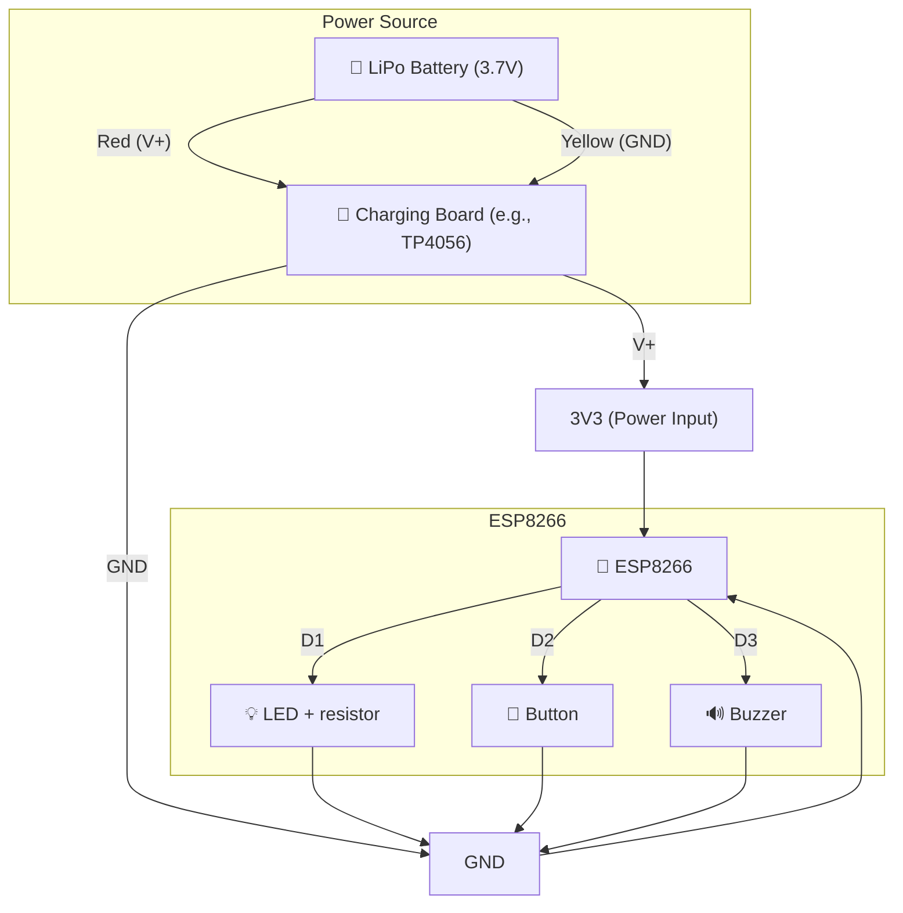

# BetterSecond Trigger

This project is a firmware for the ESP8266 that uses a button, an LED, and a buzzer to perform specific actions, such as triggering an API call to register the last few seconds of action captured by a camera. The code is designed to be simple and functional, focusing on automation and Wi-Fi connectivity.

## Features

- **Wi-Fi Connection**: Connects to a configured Wi-Fi network.
- **LED Control**: Blinks the LED at different intervals depending on the Wi-Fi connection status.
- **Button**: Detects when the button is pressed and triggers specific actions.
- **Buzzer**: Emits sound feedback when the button is pressed.
- **API Call**: Sends an HTTP POST request to an API to register the last few seconds of action captured by a camera.

## Hardware Setup

- **LED**: Connected to pin `16`.
- **Button**: Connected to pin `4` with an internal pull-up resistor.
- **Buzzer**: Connected to pin `2`.

## Network Configuration

In the code, configure the Wi-Fi network credentials:

```cpp
const char *ssid = "bts"; // Wi-Fi network name
const char *password = "<my_wifi_password>"; // Wi-Fi password
```

## API Configuration

Set the API endpoint URL where the HTTP POST request will be sent:

```cpp
String postUrl = "http://10.42.0.1:5000/record"; // Replace with the correct API endpoint
```

## How It Works

1. **Initialization**:
   - Configures the pins for the LED, button, and buzzer.
   - Connects to the Wi-Fi network.

2. **Main Loop**:
   - Monitors the Wi-Fi connection status and adjusts the LED behavior accordingly.
   - Detects when the button is pressed.

3. **Button Press Action**:
   - The LED and buzzer blink three times as feedback.
   - An HTTP POST request is sent to the configured API endpoint to register the last few seconds of action captured by a camera.

## Logs in Serial Monitor

- Wi-Fi connection status messages.
- Confirmation when the button is pressed.
- API response messages after sending the HTTP POST request.

## Circuit Diagram

<details>
<summary>View Circuit Diagram</summary>



</details>

## Future Improvements

- Add authentication support for the API call.
- Implement more robust button debounce logic.
- Add support for OTA (Over-The-Air) updates.

## License

This project is open-source. Feel free to modify and use it as needed.